  

  

  

<h2 align="center">Skill Set</h2>

<table align="center" width="100%">
  <thead>
    <tr>
      <th align="center" width="33%">Frontend</th>
      <th align="center" width="33%">Backend &amp; Database</th>
      <th align="center" width="33%">AI / ML &amp; Tools</th>
    </tr>
  </thead>
  <tbody>
    <tr>
      <td align="center">
         React
      </td>
      <td align="center">
         Node.js
      </td>
      <td align="center">
         Python
      </td>
    </tr>
    <tr>
      <td align="center">
         JavaScript
      </td>
      <td align="center">
         Express.js
      </td>
      <td align="center">
         FastAPI
      </td>
    </tr>
    <tr>
      <td align="center">
         HTML5
      </td>
      <td align="center">
         MongoDB
      </td>
      <td align="center">
         Gemini API
      </td>
    </tr>
    <tr>
      <td align="center">
         CSS3
      </td>
      <td align="center">
         MySQL
      </td>
      <td align="center">
         OpenAI API
      </td>
    </tr>
    <tr>
      <td align="center">
         Tailwind CSS
      </td>
      <td align="center">
         Git
      </td>
      <td align="center">
         LangChain <i>(Learning)</i>
      </td>
    </tr>
    <tr>
      <td align="center">
         Vite
      </td>
      <td align="center">
         GitHub
      </td>
      <td align="center">
         LangGraph <i>(Learning)</i>
      </td>
    </tr>
    <tr>
      <td align="center">
         React Router
      </td>
      <td align="center">
         Vercel
      </td>
      <td align="center">
         VS Code
      </td>
    </tr>
    <tr>
      <td align="center">
        &nbsp;
      </td>
      <td align="center">
         Render
      </td>
      <td align="center">
         Docker <i>(Learning)</i>
      </td>
    </tr>
  </tbody>
</table>

  

  

  

  

&nbsp;&nbsp;

  

  

