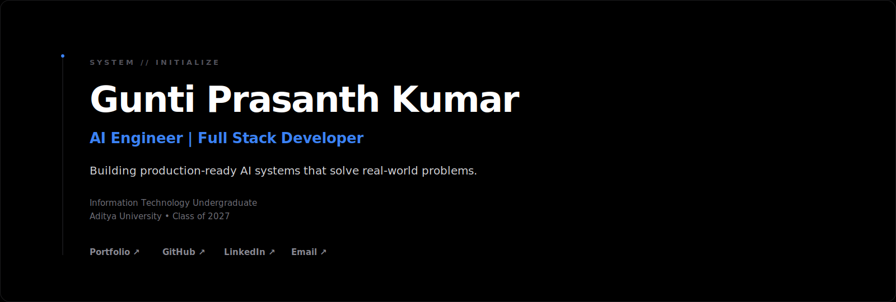
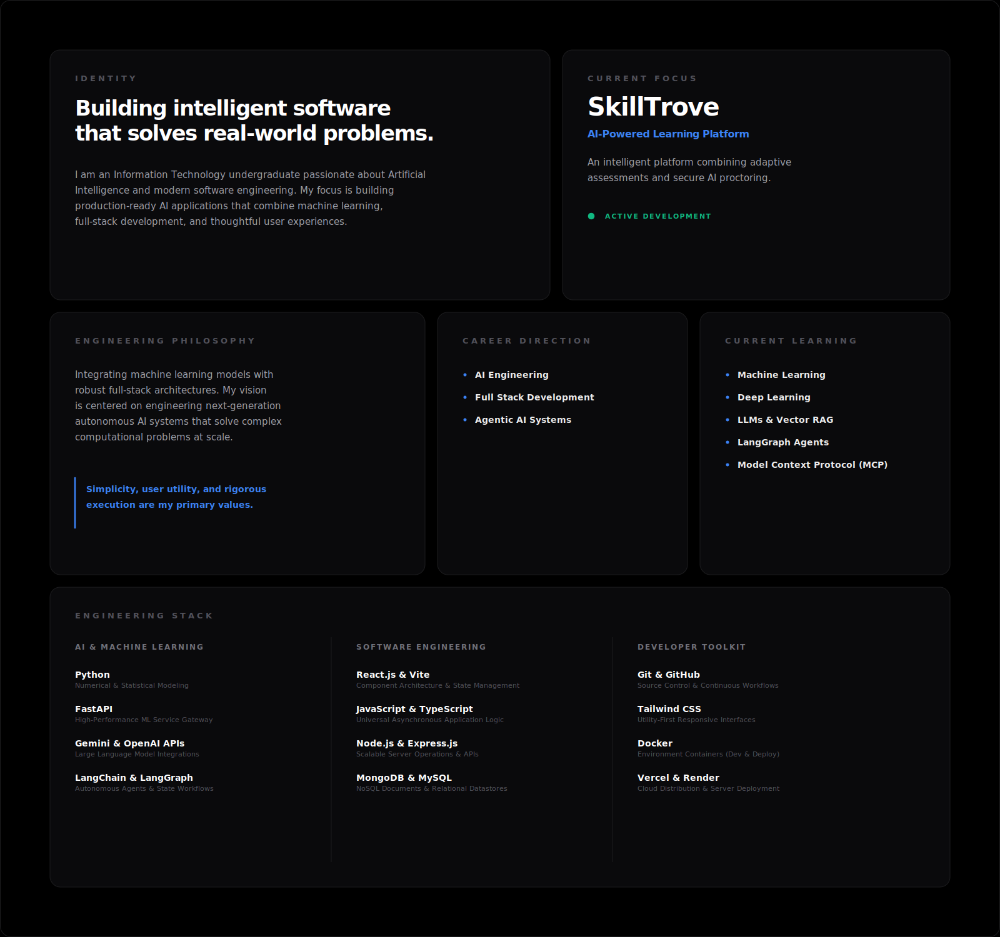

  

 

  

 

  

 

  

 

  

 

  
  &nbsp;&nbsp;
  

 

  

  

---

[Portfolio ↗](https://prasanth-future-engine.netlify.app/) &nbsp;&nbsp;·&nbsp;&nbsp; [GitHub ↗](https://github.com/GuntiPrasanthKumar) &nbsp;&nbsp;·&nbsp;&nbsp; [LinkedIn ↗](https://www.linkedin.com/in/gunti-prasanth-kumar-68207027a/) &nbsp;&nbsp;·&nbsp;&nbsp; [Email ↗](mailto:prasanthgunti07@gmail.com)

Designed &amp; Engineered by Gunti Prasanth Kumar &copy; 2026

